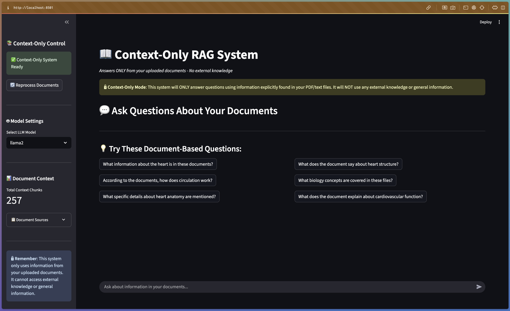

# Context-Only RAG System



A specialized document-based question-answering system that operates exclusively on uploaded documents without relying on external knowledge or general information.

## Overview

The Context-Only RAG (Retrieval-Augmented Generation) System is designed to provide accurate, document-specific answers by analyzing only the content within your uploaded PDF and text files. This approach ensures that all responses are grounded in your specific documentation, making it ideal for proprietary information, internal documents, or specialized content analysis.

## Key Features

- **Document-Only Responses**: Answers are generated exclusively from uploaded documents
- **No External Knowledge**: System does not use general AI knowledge or external sources
- **Multi-Document Support**: Process and query multiple PDF/text files simultaneously
- **Context Chunking**: Intelligent document segmentation for optimal retrieval
- **Real-Time Processing**: Upload and query documents instantly
- **Secure & Private**: All processing happens within your local environment

## System Architecture

### Core Components

- **Streamlit Frontend**: Web-based user interface for document upload and querying
- **Document Processor**: Handles PDF/text file ingestion and preprocessing
- **Context Chunker**: Segments documents into searchable chunks (currently showing 257 chunks)
- **Retrieval Engine**: Finds relevant document sections based on queries
- **Generation Model**: Currently using Llama2 for response generation
- **Context-Only Mode**: Ensures responses are strictly document-based

### Technology Stack

- **Frontend**: Streamlit web application
- **Backend**: Python-based RAG system
- **Environment**: Conda (RAG-LLM environment)
- **Model**: Llama2 LLM
- **File Processing**: PDF and text document support

## Getting Started

### Prerequisites

- Python 3.8 or higher
- Conda package manager
- Modern web browser
- Local documents in PDF or text format

### Installation

1. Clone the repository:
   ```bash
   git clone [repository-url]
   cd LOCAL_RAGLLM
   ```

2. Create and activate the Conda environment:
   ```bash
   conda create -n RAG-LLM python=3.8
   conda activate RAG-LLM
   ```

3. Install required dependencies:
   ```bash
   pip install -r requirements.txt
   ```

### Running the Application

1. Activate the Conda environment:
   ```bash
   conda activate RAG-LLM
   ```

2. Start the Streamlit server:
   ```bash
   streamlit run context_only_rag.py
   ```

3. Access the application:
   - **Local URL**: `http://localhost:8501`
   - **Network URL**: `http://192.168.12.230:8501` (accessible from other devices on your network)

### Usage

1. **Upload Documents**: 
   - Click "Reprocess Documents" to upload your PDF/text files
   - Wait for processing to complete (status will show "Ready")

2. **Ask Questions**:
   - Use the text input at the bottom to ask questions about your documents
   - Questions will be answered using only information from uploaded files

3. **Review Responses**:
   - All answers include citations to specific document sections
   - Context chunks are numbered and trackable

## Example Use Cases

The system is particularly useful for:

- **Medical/Scientific Documents**: Query research papers, medical texts, or technical manuals
- **Legal Documents**: Search through contracts, policies, or legal texts
- **Corporate Documentation**: Analyze internal reports, procedures, or guidelines
- **Educational Materials**: Study from textbooks, course materials, or research papers
- **Technical Specifications**: Query product manuals, API documentation, or technical guides

## Sample Questions

Based on the interface, here are example question types the system handles well:

- "What information about the heart is in these documents?"
- "According to the documents, how does circulation work?"
- "What specific details about heart anatomy are mentioned?"
- "What does the document say about heart structure?"
- "What biology concepts are covered in these files?"
- "What does the document explain about cardiovascular function?"

## Configuration

### Model Settings
- **Current Model**: Llama2 (configurable via dropdown)
- **Context Mode**: Locked to "Context-Only" for document-based responses
- **Chunk Limit**: Automatically optimized based on document size

### Document Processing
- **Supported Formats**: PDF, TXT
- **Maximum File Size**: [Configure based on your setup]
- **Chunk Size**: Optimized for context retrieval
- **Overlap**: Smart overlap between chunks for continuity

## System Status Indicators

- **🟢 Ready**: System is operational and ready for queries
- **🟡 Processing**: Documents are being processed
- **🔒 Context-Only Mode**: Confirms document-only operation
- **📊 Total Context Chunks**: Shows number of processed document segments

## Important Notes

### Context-Only Operation
⚠️ **Critical**: This system will ONLY answer questions using information explicitly found in your uploaded documents. It will NOT use external knowledge or general information.

### Data Privacy
- All document processing occurs locally
- No data is sent to external services
- Your documents remain private and secure

### Limitations
- Responses limited to uploaded document content
- Cannot answer questions requiring external knowledge
- Accuracy depends on document quality and completeness

## Troubleshooting

### Common Issues

1. **Conda Environment Issues**:
   ```bash
   # If environment doesn't exist, create it:
   conda create -n RAG-LLM python=3.8
   
   # Always activate before running:
   conda activate RAG-LLM
   ```

2. **Streamlit Connection Issues**:
   - Ensure port 8501 is not in use by other applications
   - Try accessing via Network URL if localhost doesn't work
   - Check firewall settings for port access

3. **No Response to Query**:
   - Ensure documents are properly uploaded and processed
   - Check that your question relates to document content
   - Try rephrasing your question

4. **Processing Stuck**:
   - Refresh the browser page and re-upload documents
   - Check file formats are supported (PDF, TXT)
   - Ensure files are not corrupted
   - Restart the Streamlit server if needed

5. **Incomplete Answers**:
   - Information may not exist in uploaded documents
   - Try more specific questions
   - Upload additional relevant documents

**Remember**: This system answers ONLY from your uploaded documents - no external knowledge is used!